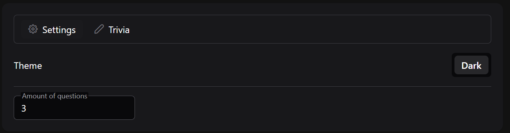
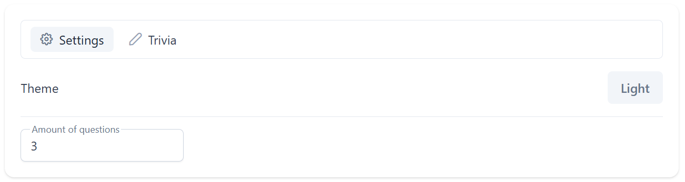
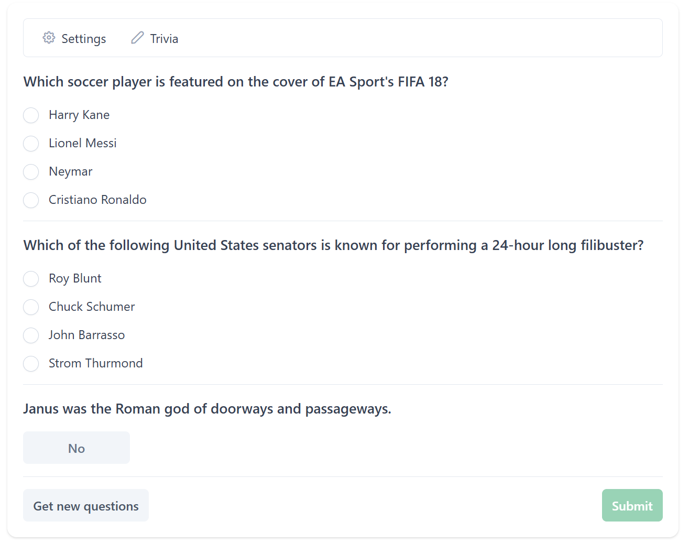
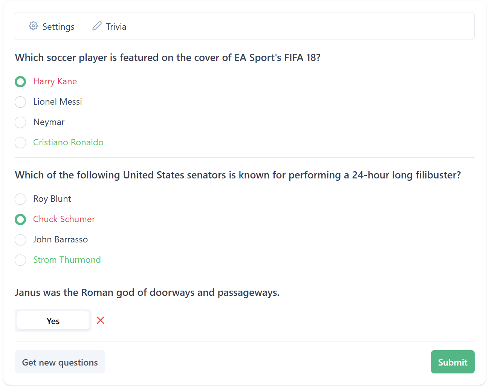

# TriviaFrontend

## Setup

Install npm on your computer. Also make sure that the correct version of Node is installed. After that install the packages with `npm -i`.

## Development server

To start a local development server, run:

```bash
  ng serve
```

Once the server is running, open your browser and navigate to `http://localhost:4200/`. The application will automatically reload whenever you modify any of the source files.

## Development

### PrimeNG and Tailwind

PrimeNG is the UI library which is used for components and theming. Tailwind is used for css utility classes.

### General

Angular CLI includes powerful code scaffolding tools. To generate a new component, run:

```bash
  ng generate component component-name
```

For a complete list of available schematics (such as `components`, `directives`, or `pipes`), run:

```bash
  ng generate --help
```

### Building

To build the project run:

```bash
  ng build
```

This will compile your project and store the build artifacts in the `dist/` directory. By default, the production build optimizes your application for performance and speed.

### Running unit tests

To execute unit tests with the [Karma](https://karma-runner.github.io) test runner, use the following command:

```bash
  ng test
```

## Future improvements

There are no limits for questions defined and currently most of the happy flow is implemented. Some specific responses should trigger messages to the user. These messages can be shown using a toaster approach which shows them as a pop-up with the option to extend the duration it is shown to the user for WCAG purposes.

The end-to-end tests have not been implemented in this project yet. This can be done in the future.

Angular CLI does not come with an end-to-end testing framework by default. You can choose one that suits your needs.

## Additional Resources

For more information on using the Angular CLI, including detailed command references, visit the [Angular CLI Overview and Command Reference](https://angular.dev/tools/cli) page.

## Screenshots

### Settings page

The theme can be changed.
The amount of questions can be changed which will fetch new questions if needed.

#### Dark mode



#### Light mode



### Trivia page

New questions can be retrieved using the 'Get new questions' button.

#### Empty form



#### Form after retrieving correct results

After submitting the correct answers are shown

